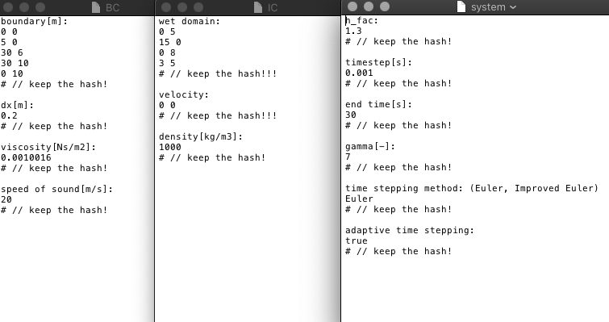

# ACSE-4-SPH

[Smoothed Particle Hydrodynamics](https://en.wikipedia.org/wiki/Smoothed-particle_hydrodynamics) (SPH) is a meshless
method for solving the Navier-Stokes equation, in which fluid properties are stored on Lagrangian fluid particles (i.e. on
particles which move with the fluid flow). The particles interact to generate values across the entire fluid domain through
continuous smoothing kernels. 

As the SPH method is meshless and Lagrangian, it is ideal for solving problems involving fluid flow with interfaces and free 
surfaces. This tool implements the SPH method in C++ to solve 2D wave generation in a lock-release/dam-break problem.

### Compilation/Installation Guide

The requirements for this program can be found in 'requirements.txt'.

A set of C++ files, located in the 'src' folder, need to be compiled with a C++ complier that has the standard c++17. 

For use of the parallelized version of the code, OpenMP is required (https://www.openmp.org/ ).

To use the output .VTK files, ParaView (an open-source data analysis and visualization application) is required. Latest version available here : https://www.paraview.org/download/ .
### User instructions

1. Create input files containing the boundary conditions and the initial conditions.

Example input files:



For the boundary conditions, the user can set variables such as the speed of
sound, c<sub>0</sub>, $\gammma$ , $\mu$ and the simulation time. Boundaries are read anti-clockwise

For the initial conditions, the user can set variables such as the initial velocity and density of the fluid. The fluid is read with min and max values - for example: a rectangular fluid of width 20 and height 10 will have min values of [0, 0] and max values of [20, 10].

2. Compile the C++ source codes within /src. 

3. Open ParaView, load the data files, apply the data and run animation.
 

### Documentation

Table of files:

| File | Description  | 
|---|---|
| src/SPH_Snippet.cpp  | C++ code that contains the main function that carries out the simulation for intervals of dt.  |
| src/SPH_2D.cpp  | C++ code that contains a main class and a particle class and their associated functions. The equations used for calculating variables, such as pressure, can be found in 'Project Description.pdf'. |
|  src/file_writer.cpp | C++ code that writes a VTK XMLPolyData (.vtp) file containing all the data for all the particles. |
|  includes/file_writer.h | Header file for 'file_writer.cpp'. |
|  includes/SPH_2D.h | Header file for 'SPH_2D.cpp'. |
|  tests/_init_.py |   |
|  tests/python_tests.py | Tests that no particle is moving faster than the set speed of sound. Tests that no particles have escaped from the domain after simulation. Checks that the pressure doesn't reach more than 50,000 Pa |
|  tests/test_file_writer.cpp |   |
|  tests/test_SPH_2D.cpp |   |


### Testing

The tool includes tests, which you can use to check its operation on your system. With the code compiled, these can be run 
with

```
python run_tests.py
```
